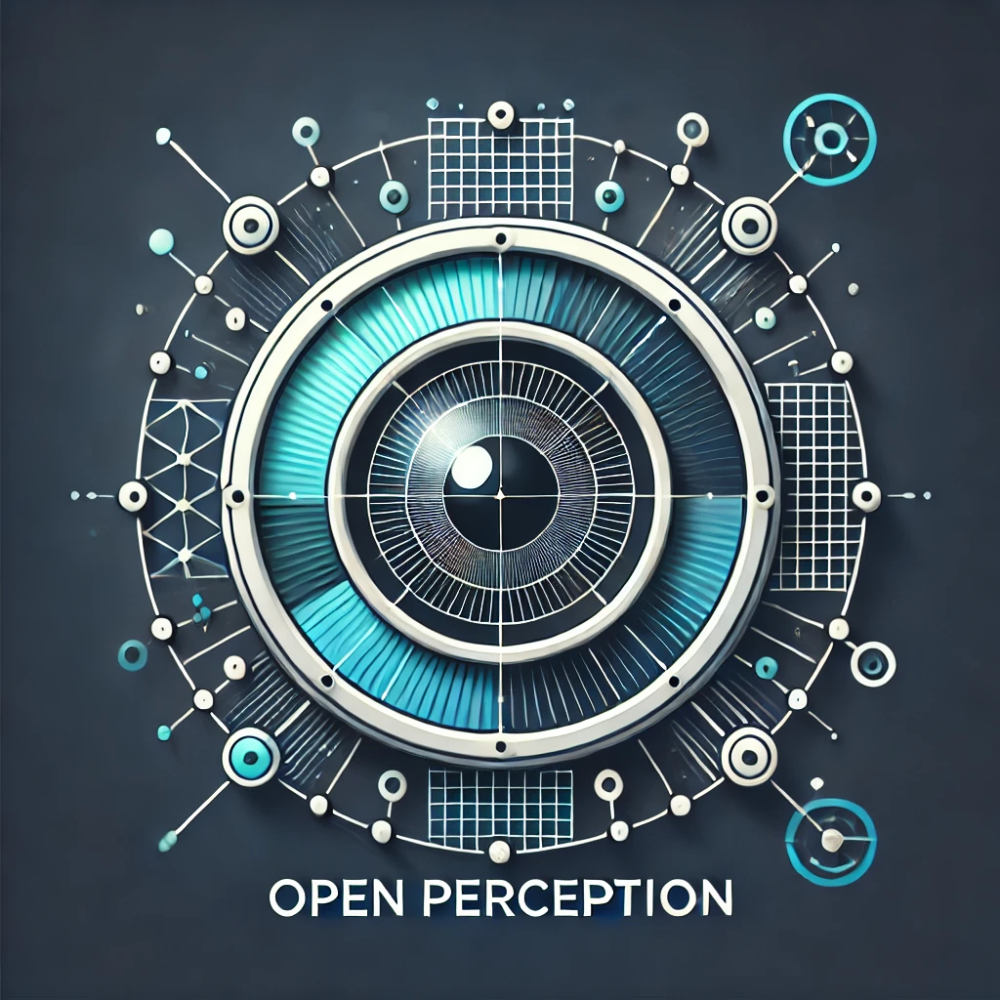

# open_perception

<div align="center">
   
</div>


The **open_perception** is an extensible framework for **real-time** **open-vocabulary** **object detection** and tracking both in 2D and 3D. Using multiple vision-language models (VLMs), such as SAM2, GroundingDINO, YOLO-World and others, the pipeline is designed to be modular, scalable, and customizable.
The integration of various communication backends (Redis, API, and ROS), makes the system suitable for a wide range of robotics and computer vision applications.

---

## Features

**Flexible Model Integration**  
   - Combine real-time Detection, Segmentation, Tracking and state estimation models in a single pipeline.
   - Multi camera support for 3D state estimation. (Coming soon)
   - Multi model support for improved accuracy.
   - Multi-granular perception, combine detection models searching in different granularity levels 

   + **Detection models**:
      - GroundingDINO
      - YoloWorld
   + **Segmentation models**:
      - SAM2
   + **State Estimation models**:
      - PCA
   
<!-- 3. **Result Aggregation**  TODO
   - Combine detections from multiple models to get improved accuracy. -->

**Multiple Communication Backends**  
   - **Redis** for efficient integration with separate pipelines.
   - (Coming soon) **API/REST API** for simple service-based integration.  
   - (Coming soon) **ROS** for robot-centric pipelines.

---

[Project Structure](docs/architecture.md).

**Key Directories**:

- **docs/**: Contains documentation on architecture, usage, and API references.  
- **config/**: Configuration files (e.g., `default.yaml`, `multigranular_dino_sam2.yaml`, etc).  
- **src/**: Source code for the pipeline, including perception models, tracking logic, and communication interfaces.  
- **scripts/**: Utility scripts for running or deploying the pipeline.
- **tests/**: Unit tests covering core functionalities.  

---


## Installation

### Prerequisites
Install [uv](https://docs.astral.sh/uv/) if you haven't already:
   ```bash
   curl -LsSf https://astral.sh/uv/install.sh | sh
   ```

### Setup
   ```bash
   git clone https://github.com/project-grappa/open_perception.git
   cd open_perception
   # Initialize uv project and sync dependencies
   uv sync
   ```

download the checkpoints:
```bash
# If using SAM2 segmentation (Recommended)
wget "https://dl.fbaipublicfiles.com/segment_anything_2/092824/sam2.1_hiera_large.pt" -O ./checkpoints/sam2.1_hiera_large.pt

# wget "https://dl.fbaipublicfiles.com/segment_anything_2/092824/sam2.1_hiera_tiny.pt" -O ./checkpoints/sam2.1_hiera_tiny.pt
# wget "https://dl.fbaipublicfiles.com/segment_anything_2/092824/sam2.1_hiera_small.pt" -O ./checkpoints/sam2.1_hiera_small.pt
# wget "https://dl.fbaipublicfiles.com/segment_anything_2/092824/sam2.1_hiera_base_plus.pt" -O ./checkpoints/sam2.1_hiera_base_plus.pt
```


**(Optional) Install Additional Model Requirements**:  
 - For using a realsense camera input run: `uv sync --extra realsense`
 - For installing yoloworld dependencies run: `uv sync --extra yoloworld`
 - For installing all dependencies for all supported models run: `uv sync --extra all` 

---

## Usage

Run the main pipeline with a default configuration:

```bash
uv run python src/main.py
```

This will start the perception pipeline with the default settings, using GroundingDino for detection, SAM2 for segmentation and PCA, a GUI interface for visualization and PCA for 3D state estimation

You can customize the pipeline by specifying a different configuration file or changing the default configuration. See [Configuration](./docs/config_overview.md) for more details.

---

## Tests

To run the test suite:

```bash
uv run pytest tests/
```

This will execute:

- **Unit Tests** for the Detection and Segmentation models. 

---

## TODOs:
- [ ] **Multi Camera Aggregation**: Combine detections and tracking from multiple cameras.
- [ ] **Result Aggregation**: Combine detections from multiple models to get improved accuracy.
- [ ] **API/REST API**: Implement simple service-based integration.
- [ ] **ROS Setup**: Ensure compatibility with robot-centric pipelines.
- [ ] **Docker Support**: Provide a reproducible environment using Docker containers.
- [ ] **Integration Tests**: Test cases for the communication interfaces: Redis, API, and ROS.

---

<!-- ## Docker Support (TODO)

Build and run the Docker container for a reproducible environment:

```bash
# Build the Docker image
docker build -t open_perception .

# Run the container
docker run --rm -it \
    -p 8000:8000 \          # for API server access
    --gpus all \            # if you need GPU access (NVIDIA)
    open_perception
```

Inside the container, you can run the pipeline or any scripts as usual. Make sure you have the correct GPU drivers installed if you need GPU inference.

--- -->

## Contributing

We welcome contributions from the community! To get started:

1. **Fork** the repository and **clone** your fork.  
2. Create a **feature branch**: `git checkout -b feature/my-new-feature`.  
3. **Implement** your feature or fix.  
4. **Test** your changes locally.  
5. Create a **pull request** describing what you’ve done :)

---

## License

This project is licensed under the [MIT License](LICENSE). Feel free to use, modify, and distribute this software in your own projects, subject to the license terms.

---


**Thank you for using open_perception!** If you have any questions or suggestions, please open an issue or reach out via the repository’s discussions. We look forward to your feedback and contributions.
